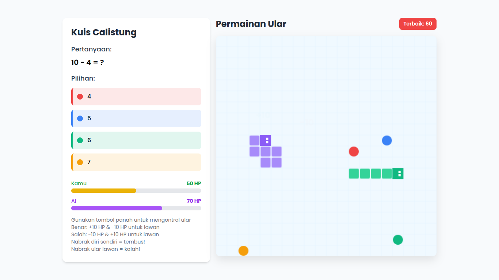

# BACA PENTING!!!

## 🐍 Game Ular Calistung

**Dibuat 100% dengan AI Code Generator [www.agencyai.id](https://www.agencyai.id) hanya dalam < 1 menit.**

---

## 🎮 Deskripsi

Game edukasi **Calistung (Baca-Tulis-Hitung)** berbasis web yang menggabungkan mekanik ular klasik. Pemain harus menjawab soal dengan cara memakan makanan yang benar.

### 🔹 Tahapan Progress

1. **progress-1.html**  
   Game Calistung dasar (tanpa ular).

2. **progress-2.html**  
   Mode **Ular Calistung Solo**. Pemain memilih makanan berwarna **merah, kuning, hijau, atau biru** sebagai jawaban yang benar.

3. **index.html (progress-3)**  
   Mode **Versus AI**. AI akan berpikir 2 detik sebelum bergerak menuju jawaban yang benar.  

   **Mekanik:**
   - Jika ular memakan jawaban benar → panjang ular **+1 bar**, dan panjang lawan **-1 bar**.
   - Ular yang kehabisan bar akan kalah.

---

## 🚀 Cara Menjalankan

1. Clone atau download repository ini.
2. Buka file `index.html` di browser untuk memainkan mode penuh (versus AI).
3. Untuk melihat progress sebelumnya buka `progress-1.html` atau `progress-2.html`.

👉 **Atau mainkan langsung di sini:**  
🔗 [https://leonafariz.github.io/ular_calistung/](https://leonafariz.github.io/ular_calistung/)

> ⚠️ Tidak perlu instalasi tambahan karena berbasis HTML, CSS, dan JavaScript murni.

---

## 📸 Preview

---

## 🙌 Credit

- **Creator & Entrepreneur:** [Leona Fariz Pratama](https://www.github.com/leonafariz)  
- **Built with:** [AI Code Generator – www.agencyai.id](https://www.agencyai.id)

---

## 🔗 Sosial Media

**Btw i'm entrepreneur, maybe we can collab or you need a job haha so follow my sosmed**

- [Instagram](https://www.instagram.com/leonafariz.ai)
- [LinkedIn](https://www.linkedin.com/in/leona-fariz-pratama)
- [YouTube](https://www.youtube.com/@leonafariz)
- [TikTok](https://www.tiktok.com/@leonafariz.ai)
- [X / Twitter](https://www.x.com/leonafariz)
- [Threads](https://www.threads.com/@leonafa.rizz)
- [GitHub](https://www.github.com/leonafariz)

---

---

# ENGLISH

## 🐍 Calistung Snake Game

**Built 100% with AI Code Generator [www.agencyai.id](https://www.agencyai.id) in under 1 minute.**

---

## 🎮 Description

A web-based **Calistung (Reading-Writing-Counting)** educational game combined with classic snake mechanics. Players answer questions by eating the correct food item.

### 🔹 Development Stages

1. **progress-1.html**  
   Basic Calistung game (no snake mechanics).

2. **progress-2.html**  
   **Solo Calistung Snake Mode**. Player chooses food in **red, yellow, green, or blue** as the correct answer.

3. **index.html (progress-3)**  
   **Versus AI** mode. AI thinks for 2 seconds before moving to the correct answer.

   **Mechanics:**
   - If the snake eats the correct answer → snake length **+1 bar**, opponent’s length **-1 bar**.
   - Snake with no bars left loses.

---

## 🚀 How to Run

1. Clone or download this repository.
2. Open `index.html` in a browser to play the full mode (versus AI).
3. To view earlier progress, open `progress-1.html` or `progress-2.html`.

👉 **Or play directly here:**  
🔗 [https://leonafariz.github.io/ular_calistung/](https://leonafariz.github.io/ular_calistung/)

> ⚠️ No extra installation needed, built with pure HTML, CSS, and JavaScript.

---

## 🙌 Credit

- **Creator & Entrepreneur:** [Leona Fariz Pratama](https://www.github.com/leonafariz)  
- **Built with:** [AI Code Generator – www.agencyai.id](https://www.agencyai.id)

---

## 🔗 Social Media

**Btw i'm entrepreneur, maybe we can collab or you need a job haha so follow my sosmed**

- [Instagram](https://www.instagram.com/leonafariz.ai)
- [LinkedIn](https://www.linkedin.com/in/leona-fariz-pratama)
- [YouTube](https://www.youtube.com/@leonafariz)
- [TikTok](https://www.tiktok.com/@leonafariz.ai)
- [X / Twitter](https://www.x.com/leonafariz)
- [Threads](https://www.threads.com/@leonafa.rizz)
- [GitHub](https://www.github.com/leonafariz)
